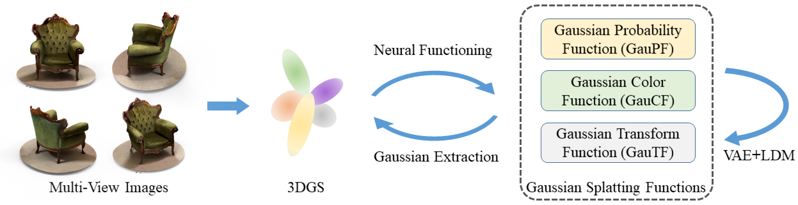
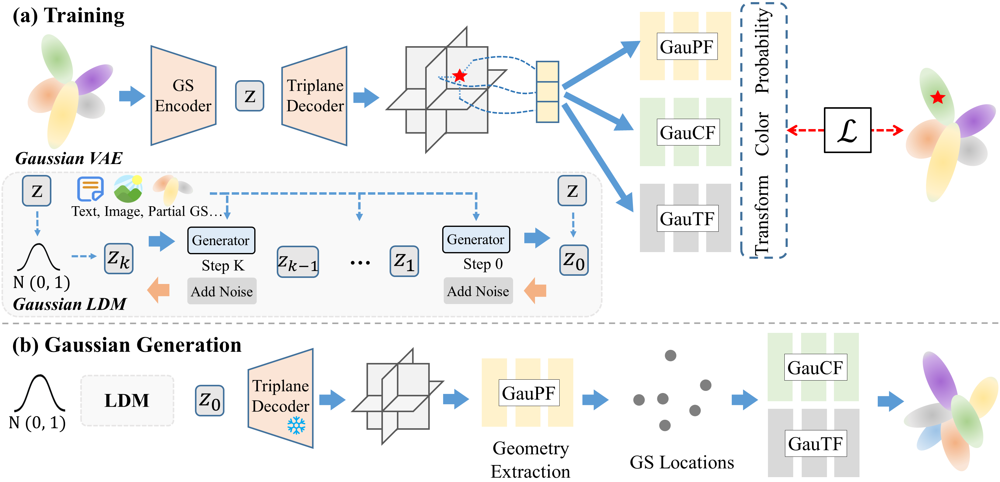
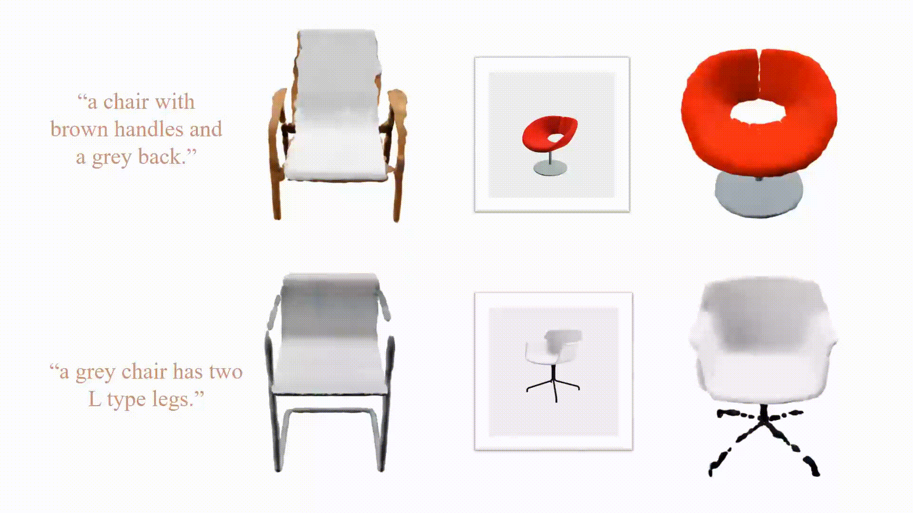
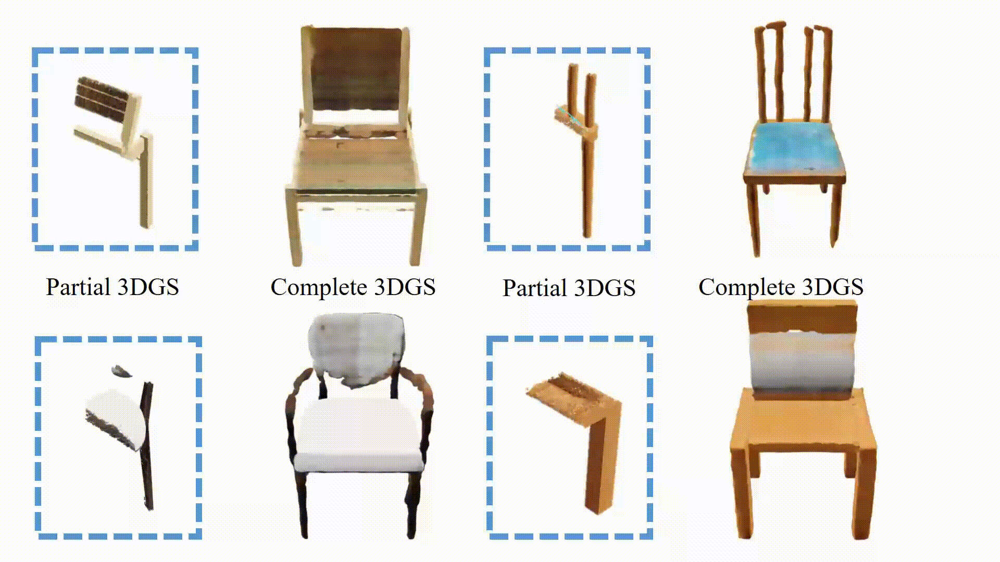

<p align="center">
<h1 align="center">DiffGS: Functional Gaussian Splatting Diffusion
(NeurIPS 2024)</h1>
<p align="center">
    <a href="https://junshengzhou.github.io/"><strong>Junsheng Zhou*</strong></a>
    ·
    <a href="https://weiqi-zhang.github.io/"><strong>Weiqi Zhang*</strong></a>
    ·
    <a href="https://yushen-liu.github.io/"><strong>Yu-Shen Liu</strong></a>
</p>
<p align="center"><strong>(* Equal Contribution)</strong></p>
<h3 align="center"><a href="">Paper</a> | <a href="https://junshengzhou.github.io/DiffGS">Project Page</a></h3>
<div align="center"></div>
</p>
<p align="center">
    
</p>


We release the code of the paper <a href="">DiffGS: Functional Gaussian Splatting Diffusion</a> in this repository.

## Abstract

<p>
In this work, we propose DiffGS, a general Gaussian generator based on latent diffusion models. DiffGS is a powerful and efficient 3D generative model which is capable of generating Gaussian primitives at arbitrary numbers for high-fidelity rendering with rasterization. We explore DiffGS for various tasks, including unconditional generation, conditional generation from text, image, and partial 3DGS, as well as Point-to-Gaussian generation. We believe that DiffGS provides a new direction for flexibly modeling and generating Gaussian Splatting. 
          </p>

## Method

<p align="center">
  
</p>
<p style="margin-top: 30px">
<b>Overview of DiffGS.</b> <b>(a)</b> We disentangle the fitted 3DGS into three Gaussian Splatting Functions to model the Gaussian probability, colors and transforms. We then train a Gaussian VAE with a conditional latent diffusion model for generating these functions. <b>(b)</b> During generation, we first extract Gaussian geometry from the generated <b>GauPF</b>, followed by the <b>GauCF</b> and <b>GauTF</b> to obtain the Gaussian attributes.
</p>


## Generation Results

### Unconditional Generations


### Visual Comparisons


## visualization Results

### Text/Image-to-3D Generation



### Gaussian Completion



### Point-to-Gaussian Generation


## Install
We recommend creating an [anaconda](https://www.anaconda.com/) environment using our provided `environment.yml`:
```
conda env create -f environment.yml
conda activate diffgs
```

## Pretrained model

We first provide the pretrained models: `Gaussian VAE` and `Gaussian LDM` of the chair unconditional model. Please download the pretrained models from [Google Drive](https://drive.google.com/drive/folders/13JyZtXV6ep26HnVIiFza0jn9F8VL5I1_?usp=sharing).


## Inference

To inference pretrained model of ShapeNet Chair, save the downloaded model checkpoint  to `config/stage1` and `config/stage2`. Additionally, you also need to adjust the checkpoint path in `config/genetate/specs.json`, then run the following command:

```
python test.py -e config/generate/
```

## Training

The code and instructions for training and data preparation will be released soon.

## Citation

If you find our code or paper useful, please consider citing

    @inproceedings{diffgs,
        title={DiffGS: Functional Gaussian Splatting Diffusion},
        author={Zhou, Junsheng and Zhang, Weiqi and Ma, and Liu, Yu-Shen},
        booktitle={Advances in Neural Information Processing Systems (NeurIPS)},
        year={2024}
    }
